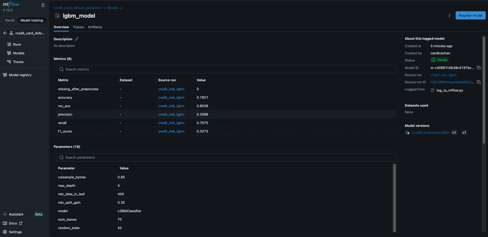

# Credit Card Default Prediction — MLOps Pipeline

> End-to-end machine learning system for credit risk scoring, built with a modular Python pipeline, Apache Airflow orchestration, and MLflow experiment tracking.


---

## Overview

This project operationalises a credit card default prediction model end-to-end — from raw data ingestion through feature engineering, model training, and experiment tracking — following MLOps best practices suitable for production deployment.

The pipeline predicts the probability that a borrower will experience serious financial distress within the next two years, enabling lenders to make more informed credit decisions.

**Dataset:** [Give Me Some Credit — Kaggle](https://www.kaggle.com/c/GiveMeSomeCredit) · 150,000 borrower records · 10 financial features

---

## Model Results

| Metric    | Score  |
|-----------|--------|
| ROC-AUC   | **0.8536** |
| Accuracy  | 0.7921 |
| Recall    | 0.7575 |
| Precision | 0.2088 |
| F1 Score  | 0.3273 |

> **ROC-AUC of 0.85** is a strong result for credit risk scoring, where class imbalance (minority defaulters) is a fundamental challenge. Recall is prioritised over precision to minimise missed defaults — a deliberate design decision aligned with risk management objectives.

---

## MLflow Experiment Tracking

> *Screenshot: MLflow UI showing tracked metrics, parameters, and registered model*

<!-- Replace with your actual screenshot -->


The model is registered in the **MLflow Model Registry** as `CreditCardDefaultLGBM v1`, with full lineage tracing from raw data to deployment artifact.

**Tracked per run:**
- All 16 hyperparameters
- 6 evaluation metrics
- Preprocessing diagnostics (missing value counts)
- Predictions CSV as a logged artifact
- Source script provenance (`log_to_mlflow.py`)

---

## Architecture

```
Raw CSVs
   │
   ▼
┌─────────────────────────────────────────────────────┐
│                  Airflow DAG                        │
│                                                     │
│  load_data → split_data → preprocess_data           │
│      → engineer_features → upsample_and_scale       │
│          → train_model → predict_validation         │
│                                                     │
│  (MLflow logs params, metrics & artifacts each step)│
└─────────────────────────────────────────────────────┘
   │
   ▼
MLflow Model Registry → predictions.csv
```

**Stack:**

| Layer | Tool |
|---|---|
| Orchestration | Apache Airflow 2.8 |
| Experiment Tracking | MLflow 3.10 |
| Model | LightGBM Classifier |
| Language | Python 3.10 / pandas |
| Environment | Conda |

---

## Pipeline Stages

**1. Data Ingestion** — loads training (150k rows) and validation sets from CSV, renames anonymous index to `CustomerID`.

**2. Train/Test Split** — stratified 80/20 split on `SeriousDlqin2yrs` target to preserve class balance across splits.

**3. Preprocessing** — removes outliers via quantile thresholding on `DebtRatio`, caps `RevolvingUtilizationOfUnsecuredLines` at 10, imputes `MonthlyIncome` with median, and fills `NumberOfDependents` nulls with 0.

**4. Feature Engineering** — constructs 8 domain-driven features:

| Feature | Description |
|---|---|
| `CombinedPastDue` | Sum of all delinquency buckets (30/60/90+ days) |
| `CombinedCreditLoans` | Open credit lines + real estate loans |
| `MonthlyIncomePerPerson` | Income adjusted for number of dependents |
| `MonthlyDebt` | Monthly income × debt ratio |
| `isRetired` | Binary flag for age > 65 |
| `hasRevolvingLines` | Binary flag for revolving credit activity |
| `hasMultipleRealEstates` | Binary flag for ≥ 2 real estate loans |
| `IsAlone` | Binary flag for no dependents |

**5. Class Imbalance Handling** — SMOTE oversampling available (configurable); `scale_pos_weight=10` in LightGBM is the primary strategy to preserve real data distribution.

**6. Model Training** — LightGBM with tuned hyperparameters for credit risk (shallow trees, high regularisation, elevated positive class weight).

**7. Validation Scoring** — produces prediction labels and probability scores on the held-out validation set.

---

## Project Structure

```
├── dags/
│   ├── credit_card_pipeline_dag.py   # Airflow DAG (10 tasks)
│   └── ML_pipeline/                  # Modular pipeline components
│       ├── dataset.py
│       ├── data_splitting.py
│       ├── data_preprocessing.py
│       ├── feature_engineering.py
│       ├── upsampling_minorityClass.py
│       ├── scaling_features.py
│       ├── model_params.py
│       ├── train_model.py
│       └── predict_model.py
├── data/                             # Input CSVs (gitignored)
├── output/                           # Predictions & intermediate artifacts
├── log_to_mlflow.py                  # Standalone MLflow logging script
├── requirements.txt
└── README.md
```

---

## Quickstart

### Prerequisites
```bash
conda create -n credit_risk python=3.10 -y
conda activate credit_risk
conda install -c conda-forge mlflow lightgbm imbalanced-learn scikit-learn pandas numpy scipy
```

### Run with MLflow tracking
```bash
# Terminal 1 — start MLflow server
mlflow server --host 127.0.0.1 --port 5001

# Terminal 2 — run the pipeline
git clone https://github.com/cyycan/credit-risk-mlflow-pipeline.git
cd credit-risk-mlflow-pipeline

# Add your data files
cp /path/to/cs-training.csv data/
cp /path/to/cs-test.csv     data/

python log_to_mlflow.py --port 5001
```

Open **http://127.0.0.1:5001** to explore the experiment run.

### Run with Airflow
```bash
export AIRFLOW_HOME=$(pwd)
export AIRFLOW__CORE__DAGS_FOLDER=$(pwd)/dags
export MLFLOW_TRACKING_URI=http://127.0.0.1:5001

airflow db init
airflow users create --username admin --password admin \
  --firstname Admin --lastname User --role Admin --email admin@example.com
airflow scheduler &
airflow webserver --port 8080
```

Open **http://localhost:8080**, enable and trigger `credit_card_default_pipeline`.

---

## Key Design Decisions

**Recall over precision** — in credit risk, the cost of missing a defaulter (false negative) far exceeds the cost of flagging a good borrower (false positive). The model is tuned accordingly via `scale_pos_weight` and threshold selection.

**Modular pipeline** — each ML step is an independent, testable Python module. The Airflow DAG wraps these modules without modifying business logic, making it easy to swap components or run them standalone.

**Parquet for inter-task communication** — Airflow XCom has a 48KB limit. Intermediate DataFrames are serialised to Parquet and paths passed via XCom, enabling large-scale data flow without a dedicated data store.

**MLflow Model Registry** — the trained model is versioned and registered, providing a clear promotion path from experimentation to staging to production.

---

## Possible Improvements

- Hyperparameter tuning with Optuna + MLflow autologging
- Feature importance analysis and SHAP explainability
- Segmented model evaluation and add precision and recall curve and confusion matrix
- Model monitoring for data drift post-deployment
- CI/CD pipeline with GitHub Actions to retrain on schedule
- Containerise with Docker for portable deployment

---

## Author

**Candice Chen** · Lead Data Scientist  
[LinkedIn](https://linkedin.com/in/candiceyunchen) · [GitHub](https://github.com/cyycan)
